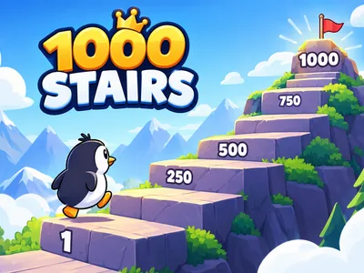
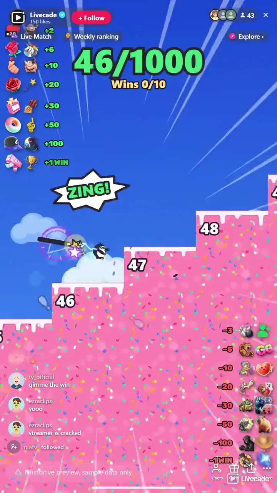

# 1000 Stairs - Interactive TikTok Live Game

> You climb 1000 stairs, your chat decides whether you make it.

You climb a staircase of 1000 stairs live, jump by jump, while your chat decides how far you get. Heroes carry you up, villains knock you back down, and once you reach the top you have to hold it through a countdown to win.

**[Play 1000 Stairs on Livecade](https://livecade.io/games/1000-stairs/?utm_source=github&utm_medium=readme&utm_campaign=1000-stairs)** - runs as a single browser source in OBS, Streamlabs, or TikTok LIVE Studio. Nothing for viewers to install.

## How viewers play

Viewers take part with the actions TikTok already gives them: **comments**, **gifts**, **likes**, **follows**, **shares**. Every action below is rebindable, so you decide which interaction drives which effect.

| Action | What it does |
| --- | --- |
| **Grandpa** | Hooks the climber with his cane and yanks him up 2 stairs |
| **Unicorn** | Scoops him onto its back and gallops 5 stairs up |
| **Sumo** | A belly bump that sends him 10 stairs up |
| **Magic Wand** | Follows him up firing spells into his back, 20 stairs |
| **Jetpack** | Blasts him 30 stairs up on a smoke trail |
| **Giant Finger** | Pokes him 50 stairs up the staircase |
| **Lightning Ninja** | Rides a bolt of lightning with him, 100 stairs up |
| **Bowling Ball** | Bowls him over like a pin, 3 stairs down |
| **Scratching Cat** | Lands on his face so he stumbles 5 stairs down blind |
| **Angry Granny** | A swing of the handbag, 10 stairs down |
| **Giant Foot** | A giant leg drops out of the sky and kicks him 20 stairs down |
| **Bus** | Carries him 30 stairs down on its grill |
| **Minigun** | Chases him 50 stairs down in a hail of tracers |
| **Black Flame Sorcerer** | A wave of black fire sweeps him 100 stairs down |
| **+Win** | A trophy with the sender's name, confetti, coins and a crown: one win |
| **-Win** | A thief steals a win and the crown, even below zero |

## How it works

### You play it, live

Walk with A and D and jump with W, Space or a click, straight from the dashboard. Time a jump well and the climber flips onto the next stair; a little off and it scrambles up the edge. The climber runs in your own browser, so it answers instantly, and the stream shows the same moves a moment later.

### Heroes up, villains down

Fourteen characters, each with its own animation, sound and stair count, and each bindable to any trigger. Hits stack instead of queueing, so a flood of gifts is a flood on screen.

### Hold the top

The last stair starts a countdown. A villain that knocks you off stops it, and a hero that lands on the top waits to carry you back up after the next villain.

### Five worlds on the way up

Candy Town, Jungle Treetops, Mountain Peaks, Storm Clouds and Heaven, one for each fifth of the climb, so how far you got reads at a glance.

## About the game

1000 Stairs puts a cartoon climber at the bottom of a very long staircase and your viewers on both sides of it. You walk and jump each stair yourself, timing the jump so you flip onto the next one or scramble up its edge, or you let the climber go on its own. Every trigger in chat is a hero that carries you up or a villain that knocks you down, and the climb is won at the top.

### Seven heroes, seven villains

Heroes push you up: Grandpa hooks you with his cane, a unicorn gallops you up on its back, a sumo belly-bumps you, a magic wand fires spells into your back, a jetpack blasts you up, a giant finger pokes you along, and a lightning ninja rides a bolt with you. Villains send you down: a bowling ball bowls you over like a pin, a cat lands on your face, an angry granny swings her handbag, a giant foot kicks you, a bus carries you off on its grill, a minigun chases you down, and a black flame sorcerer sweeps you away in fire. Every one of them lands with a screen shake, a stamp and its own sound, and hits stack, so a busy chat piles them up at once.

### The top is not the end

Reaching the last stair starts a hold countdown. A villain that knocks you off stops it, and you have to climb back and start it over, so the last few seconds are when chat fights hardest. A hero that lands while you stand on the top has nowhere to take you, so it waits and carries you back up after the next villain. Hold the top and you win, and the climb starts again from stair 0.

### Wins, a crown, and a heist

Wins count on screen, and viewers can move the count directly. A +Win drops a trophy with the sender's name on it, with confetti and a rain of coins, and crowns the climber. A -Win sends a thief who zips down a rope, pries the win off the counter, snatches the crown and runs. Set a win goal and reaching it ends the game on a game-over screen with a New Game button.

## What it looks like on stream

[Watch 1000 Stairs gameplay](https://cdn.livecade.io/games/1000-stairs.mp4)

## What you can configure

- **Interface language** - Thirteen languages for everything on screen
- **Climber** - Play it yourself with the keyboard and mouse, or let it climb on its own
- **Character** - A penguin, a capybara, a frog or a goat
- **Stairs to the top** - 250, 500, 1000 or 2000 stairs, so a short live gets a short climb
- **Hold time at the top** - Three to sixty seconds the climber has to stay on the top stair to win
- **Win goal** - The wins that end the game on the game-over screen, or 0 to play without one

## Languages

English, Spanish, Portuguese, French, German, Italian, Indonesian, Arabic, Turkish, Russian, Hindi, Romanian, Filipino

## FAQ

<strong>How do viewers play 1000 Stairs?</strong>

They send heroes and villains. Out of the box, 20 likes bring Grandpa, a follow rolls the Bowling Ball, and gifts cover the rest, from a Rose for the Unicorn up to a Galaxy that steals a win. Every action can be rebound to comments, likes, follows, shares or any gift, each with its own stair count.

<strong>Do I have to play it myself?</strong>

No. Set the climber to Auto and it climbs on its own, which keeps the stream going while you talk to chat. Switch back to manual at any time.

<strong>Can villains stop me from winning?</strong>

Yes. Reaching the top only starts the hold countdown. A villain that knocks you off stops it, and you have to climb back up and hold the top through the whole countdown again.

<strong>What happens to a hero sent while I am already on the top?</strong>

Its stairs are saved. It plays straight away, and the next time a villain knocks you down it comes back to carry you up. If you win first, it hits your next climb instead.

<strong>How do I add 1000 Stairs to my TikTok Live?</strong>

Add one browser source URL to OBS or your streaming software and go live. There is no plugin to install and nothing for your viewers to download.

## Setup

1. [Create a Livecade account](https://app.livecade.io/register?utm_source=github&utm_medium=cta&utm_campaign=1000-stairs)
2. Copy your overlay browser source URL
3. Paste it into OBS, Streamlabs, or TikTok LIVE Studio
4. Pick 1000 Stairs, set your triggers, and go live

Runs in the browser, so it works on Windows and macOS with nothing to download. [See all TikTok Live games](https://livecade.io/tiktok-live-games/?utm_source=github&utm_medium=readme&utm_campaign=1000-stairs).

---

_This repository documents 1000 Stairs, a hosted interactive game by [Livecade](https://livecade.io/?utm_source=github&utm_medium=footer&utm_campaign=1000-stairs). The game runs on Livecade's platform, so there is no source to install here._
